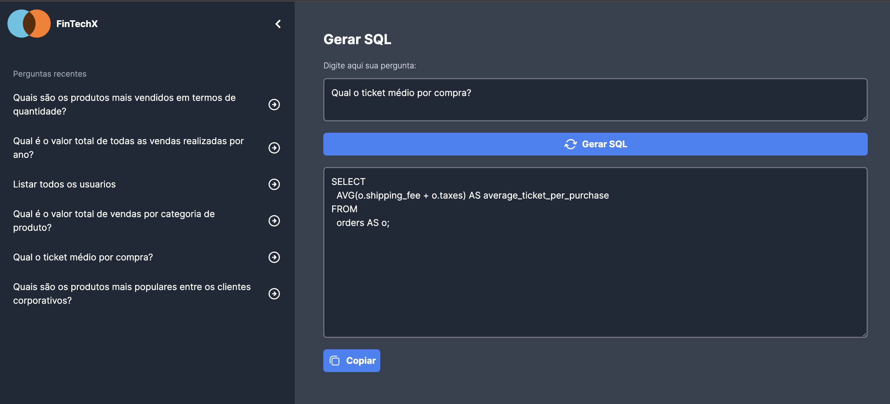

## FinTechX text2sql app

This is an application to generate sql from a requirements based on a internal database schema



### Structure
#### api
- Node.js API with Express.
- [Gemini API](https://ai.google.dev/?gad_source=1&gclid=EAIaIQobChMIxsOGy6rChQMVL15IAB0JYAv2EAAYASAAEgIuQfD_BwE) as a Generative AI.
- Redis as cache system.

### client
- Next.js app.
- Context API.


### How to execute
1. go to api/ folder and create a .env file copying the values from .env.example.
2. change the GEMINI_API_KEY with your key.
3. execute ```docker-compose up``` on the project root.
4. access the app with ```http://localhost:3001```, and if you want to access the API, use ```http://localhost:3000```